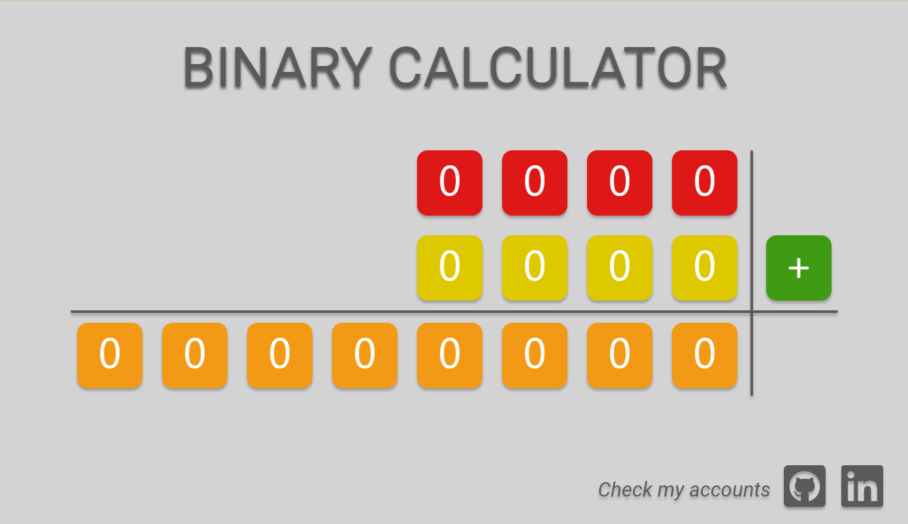
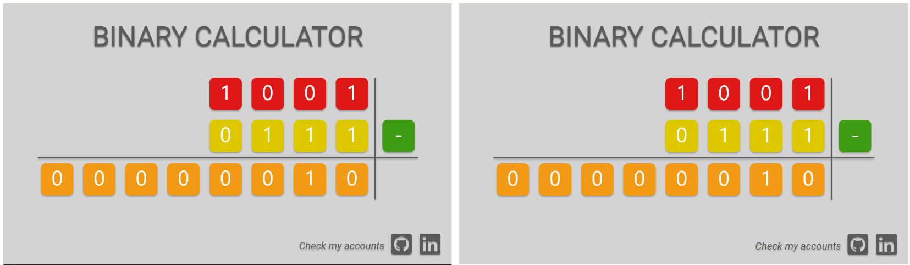

# Binary Calculator 

This is a web application that allows you to perform basic operations on binary numbers.

## Description

The application is used to perform basic mathematical operations on binary numbers. The page consists of three sets of blocks and an operator. Clicking on the blocks responsible for taking arguments changes the value of a given block from 1 to 0 and vice versa. This, in turn, causes a different result of a given operation, which automatically displays itself in the changed version. Clicking on the operator block, on the other hand, changes the mathematical action being performed. Addition, multiplication, division, and subtraction are available.

## Features

* Clicking on the block responsible for taking arguments changes its value from 0 to 1 and vice versa.
* Clicking on the operator block changes its icon, and thus the action is performed on binary numbers. Addition, subtraction, multiplication, and division are available.
* Blocks that display the result are not clickable.
* At the bottom of the page there are references to the author's accounts.

## Application layout

* Below are screenshots showing the appearance of the application depending on the choice of language.

* When performing calculations.

* Different variants of the operator. 

## How to run? 

`npm run start` to start project. 